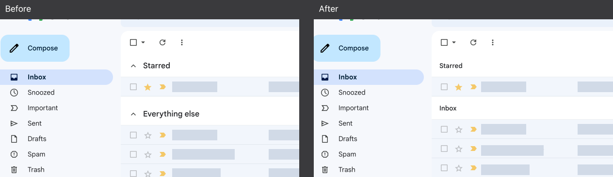

# Gmail Cleanup

A tiny Google Chrome extension that alters the look and feel of Gmail's Inbox for users that use "grouped" or segmented inbox types. This extension makes the grouping less prominent visually and changes the label "Everything else" to "Inbox".

*Currently there are no plans to add additional functionality to this extension.*

### Manifest V3 Extension Example

The purpose of making this extension open source is to serve as a working code example of injecting JavaScript onto a page using [Chrome's Manifest V3](https://developer.chrome.com/docs/extensions/mv3/intro/).

When I set out to write this extension, I thought it would take 10 minutes. Due to lack of good examples and having to read a lot of documentation it ended up taking a couple hours.

Because of this, I decided to publish my code and I have added detailed comments everywhere to explain what is happening.

### Support and maintenance

I will not answer support questions/issues. This isn't an active open source project, it is posted here primarily to be a code sample. Use Google's documentation and Stack Overflow if you have specific questions.

However, I will review pull requests and accept them if they fix a problem or improve the code quality.